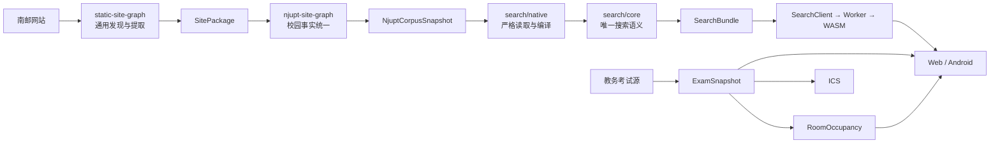

<div align="center">


# njupt-search

### 让散落在校园各处的信息，真正可以被找到

南京邮电大学校园全文检索、考试安排与教室占用的一站式信息入口。<br />
无搜索服务器、无在线数据库：Rust 搜索引擎在浏览器的 Web Worker 中通过
WebAssembly 运行，数据以静态制品按需抵达用户。

[](https://njupt.hicancan.top)
[](https://github.com/hicancan/njupt-search/actions/workflows/ci.yml)
[](https://github.com/hicancan/njupt-search/releases/latest)
[](LICENSE)

[在线使用](https://njupt.hicancan.top) ·
[Android 下载](https://github.com/hicancan/njupt-search/releases/latest/download/njupt-search-latest.apk) ·
[架构说明](docs/architecture.md) ·
[参与开发](#本地开发)

</div>

---

## 为什么做这个项目

校园信息并不稀缺，稀缺的是抵达信息的路径。

通知、规章、办事流程、讲座和下载附件分散在不同部门与学院站点；考试安排
藏在表格中，教室占用又需要从考试事实进一步推导。传统搜索引擎很难完整理解
这些校园内部结构，而逐个站点翻找会把本应简单的问题变成反复试错。

`njupt-search` 希望把这段距离缩短成一次输入：

- 搜索跨站点的正文与附件，不需要先知道信息属于哪个部门；
- 按班级查询考试，查看时间、地点并导出 ICS 日历；
- 按校区、楼宇、楼层和日期查看教室占用；
- 在 Web 与 Android 中使用同一套产品能力。

最近一次固定完整数据构建覆盖 **15 个校园来源、2 万余份正文和近 9 千个
附件**。这些数字会随上游事实持续更新，而搜索代码不随数据发布而改动。

## 核心特性

| 能力 | 实现 |
| --- | --- |
| 校园全文检索 | 标题、正文与附件统一进入倒排索引，支持来源、类型与日期筛选 |
| 浏览器原生搜索 | 唯一 Rust core 同时服务 Native 与 WASM；检索不依赖在线搜索 API |
| 按需静态分发 | 首先加载轻量目录与词典，查询时加载 postings，确定 Top-K 后再取正文块 |
| 考试与日历 | 从显式教务来源编译 ExamSnapshot，按班级查询并导出确定性 ICS |
| 教室占用 | 由 ExamSnapshot 与唯一 RoomCatalog 编译 RoomOccupancy |
| 自动更新 | 语料与教务独立构建为 OCI 制品，只在 Web 组装阶段汇合 |
| 多端交付 | React Web 产品与 Android TWA 外壳共享同一线上能力 |

## 系统如何工作



这里有三条刻意保持稳定的原则：

1. **事实属于上游。** `njupt-site-graph` 生产唯一
   `NjuptCorpusSnapshot`；本仓库严格验证后编译，不重新爬取、去重或修补事实。
2. **搜索语义只有一个。** 规范化、分词、召回、排名和摘要全部位于
   `search/core`；Native 与 WASM 使用同一 Rust 实现。
3. **制品不是源码版本。** Corpus、SearchBundle 与 Academics 是 GHCR 中
   按内容寻址的 OCI 制品；Git Tags 与 GitHub Releases 只表达软件版本及其
   Android 安装包。

完整对象边界、依赖方向和制品契约见
[架构文档](docs/architecture.md)。

## 仓库结构

```text
apps/         Web 与 Android 产品交付
search/       CorpusSnapshot → SearchBundle → Query → SearchResponse
academics/    ExamSource → ExamSnapshot → RoomOccupancy / ICS
benchmarks/   从系统外部测量真实生产入口
ops/          显式路径、命令顺序与 Web 组装
docs/         与当前代码一致的设计说明
```

这六个目录并非六个平级业务层：`search`、`academics`、`apps` 是三个生产
本体；`benchmarks`、`ops`、`docs` 是外围支撑。

## 本地开发

需要 Node.js 24、Rust stable、`wasm32-unknown-unknown`、`wasm-pack`、
Python 3.12 与 `uv`。

```powershell
npm ci
uv sync --extra test
.\ops\test.ps1 -Mode quick
```

启动前端开发服务器：

```powershell
npm run build:wasm:web
npm run dev
```

源码树不保存语料、索引、考试输出、可复用缓存或 Web staging。完整数据通过
显式外部路径构建：

```powershell
.\ops\build-search-bundle.ps1 `
  -CorpusPath D:\Data\njupt-refactor\corpus-current `
  -BundlePath D:\Data\njupt-refactor\njupt-search-current\search-bundle
```

考试与教室制品同样从显式输入和空输出目录构建：

```powershell
uv run python -m academics.exam discover `
  --output D:\Data\njupt-refactor\njupt-search-current\exam-source.json

.\ops\build-academics.ps1 `
  -SourcePath D:\Data\njupt-refactor\njupt-search-current\exam-source.json `
  -MaterializedPath D:\Data\njupt-refactor\njupt-search-current\exam-materialized `
  -CachePath D:\Cache\njupt-search\exam-source `
  -ExamOutputPath D:\Data\njupt-refactor\njupt-search-current\exam-snapshot `
  -RoomOutputPath D:\Data\njupt-refactor\njupt-search-current\room-occupancy `
  -RoomCatalogPath .\academics\room\catalog\njupt-room-catalog.json
```

完整 156 条真实查询质量测量：

```powershell
node benchmarks\search\quality.mjs `
  --bundle D:\Data\njupt-refactor\njupt-search-current\search-bundle
```

更多构建与组装命令见 [架构文档](docs/architecture.md) 和 `ops/`。

## 自动更新

两条生产链彼此独立：

```text
NjuptCorpusSnapshot → SearchBundle
ExamSourceDescriptor → ExamSnapshot → RoomOccupancy
```

每次成功构建都会生成一个按 OCI manifest digest 寻址的不可变制品，并以
单个 JSON 指针原子更新当前输入。任一链路更新后，工作流读取另一条链路的
明确制品，组装完整静态站点，再把同一份 `dist` 交给 EdgeOne 部署。

语料由 [`njupt-site-graph`](https://github.com/hicancan/njupt-site-graph)
生产；通用站点发现与提取能力来自
[`static-site-graph`](https://github.com/hicancan/static-site-graph)。

## 项目边界

- 本项目不是南京邮电大学官方服务。
- 校园站点与教务数据的权利归其原始发布方所有。
- 本项目只为学习、研究与非商业校园信息服务提供聚合入口。
- 输入损坏、身份不一致或格式不兼容时直接失败，不静默回退旧数据。

## License

[AGPL-3.0](LICENSE)
