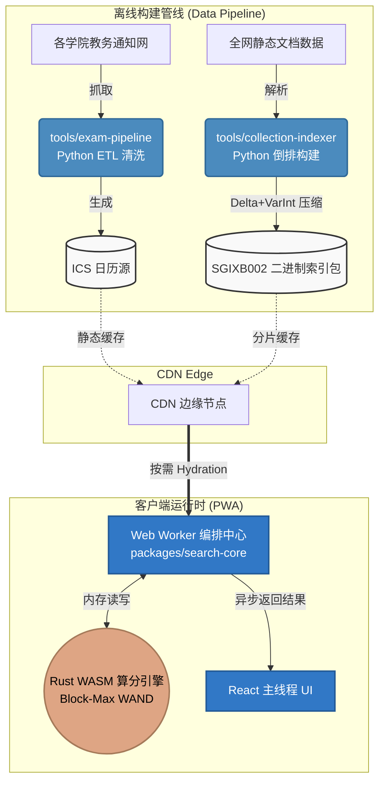

<div align="center">

# njupt-search

南京邮电大学无服务端聚合检索与信息服务系统

[](LICENSE)
[](https://www.typescriptlang.org/)
[](https://www.rust-lang.org/)
[](https://www.python.org/)
[](https://vite-pwa-org.netlify.app/)

[**在线访问**](https://njupt.hicancan.top) • [**设计初衷**](#-项目定位与初衷-the-vision) • [**核心特性**](#-核心特性矩阵-core-features) • [**底层技术剖析**](#️-底层硬核技术剖析-deep-dive) • [**代码库全景**](#️-monorepo-代码架构-project-structure) • [**本地开发**](#-本地开发与部署-quick-start)

</div>

---

## 📖 项目定位与初衷 (The Vision)

**痛点：严重的信息孤岛与获取门槛**  
南京邮电大学的各类教务通知、考试排期、竞赛奖助等信息，长期分散在不同的二级学院和管理部门站点中。更加棘手的是，大量关键信息以非结构化文档附件（PDF、DOCX、XLSX）的形式存在。师生在需要跨域检索特定政策或查询自己的考试安排时，面临着极高的“信息差”壁垒。

**破局方案：njupt-search**  
本项目旨在彻底打破这种信息屏障，构建一个**完全去服务端化、静态边缘分发的垂直聚合搜索引擎与教务日历服务**。我们通过离线数据管线（Data Pipeline）提前提取全校非结构化数据，并在用户侧浏览器内（依赖 Web Worker + WebAssembly）闭环完成极速检索。没有中心化数据库，没有高昂的服务器成本，以纯端侧计算重构检索引擎体验。

---

## ✨ 核心特性矩阵 (Core Features)

| ⚡️ 无服务端架构 (Serverless Edge) | 🦀 Next-Gen 检索引擎 (WASM) | 📅 幂等自动化教务管线 (ETL) | 📱 极致离线体验 (PWA) |
| :--- | :--- | :--- | :--- |
| 摒弃传统关系型数据库与 Elasticsearch。全量索引静态分发，依托 CDN 边缘节点实现无限并发与毫秒级 TTFB 响应，永不宕机。 | 基于 Rust 编译的 WebAssembly 算分模块，配合 Block-Max WAND 动态剪枝算法，在浏览器内实现海量倒排表的 Sub-ms 级竞争性打分。 | 基于 Python `pydantic` 与高阶正则的自动化爬虫与数据清洗工厂。智能容错教务处表格的“脏数据”，自动结构化生成 ICS 考试日历。 | 核心检索能力深度集成 Service Worker 缓存策略，离线状态下依然可进行全文检索与日历查阅。并支持 Android 端 TWA 原生打包。 |

---

## 🛠️ 核心架构剖析 (Architecture)

本项目绝非简单的聚合页面，其背后蕴含着高度定制化的数据结构与编译级优化策略。

### 1. `SGIXB002` 极致压缩二进制倒排协议
传统的 JSON 倒排索引在网络传输时极其臃肿。本项目在离线阶段 (`tools/collection-indexer`) 彻底舍弃了文本结构，独创了 `SGIXB002` 紧凑二进制格式：
*   **Delta-Encoding (差值编码)**：将倒排表中的绝对文档 ID ($D_i$) 替换为相邻文档 of 差值 ($D_i - D_{i-1}$)，从而将大整数降维成极小的正整数差值。
*   **VarInt (7-bit 变长整数压缩)**：针对降维后的差值，采用可变长度编码（字节最高位第 8 位作为延续标志位，其余 7 位存储数值）。对于小型差值仅需 1 个字节即可存储。
*   **按需路由与渐进加载 (Query-Planned Progressive Hydration)**：首屏启动仅拉取源注册表（`source_registry`）和全局路由表（`global_query_directory`），体积仅数百 KB。倒排索引的分片和主体部分 (`light_index_packed` 和 `body_index_packed`) 仅在用户输入特定查询词并完成匹配路径规划后，才会按需加载和实例化。
*   **成果**：二进制倒排体积较原始 JSON 数据缩减达 **82%** 以上，显著降低了初次网络传输与解包的资源开销。

### 2. Rust WASM 的 O(1) 块级剪枝算法 (Block-Max WAND)
在数以万计的文档倒排表合并时，普通的前端 JS 循环会导致主线程严重掉帧。我们在 `tools/wasm/packed-impact-decoder` 中，使用 Rust 实现了一种激进的提前跳跃算法：
*   **SGIXB002 格式的 O(1) 词项跳过**：在解析二进制索引时，`SGIXB002` 头部维护了词项 payload 长度目录。对于未被查询命中的词项，WASM 引擎会直接移动读取指针（Offset Jump）在 $O(1)$ 时间内跳过其整块数据，**在底层实现了物理级别的零解压（Zero-Decompression）**。
*   **Block-Max WAND 动态剪枝**：块（Block，默认 32 个文档 ID）的文档打分上限按 Impact 降序排列。如果当前评估块的最大可能分数（当前块的 Term Impact 加上后续未评估 Term 的最大 Impact 之和）低于已收集的 Top-K 候选结果的最低门槛（Competitive Threshold），则引擎在算分循环中**直接整块剪枝跳过**。
```rust
// 计算当前词项块及后续未评估词项块的最大可能算分上限
let max_possible_for_unseen_doc = block.impact + suffix.get(index + 1).copied().unwrap_or(0.0);

// 如果该块所有文档理论最大分数依然低于已评估的 Top-K 候选门槛 (competitive_threshold)
// 且该块内的文档不属于已知的候选者，则引擎将直接整块剪枝跳过，免去对该块文档的算分评估与 Top-K 插入！
if !has_known_candidate && scores.len() >= target && max_possible_for_unseen_doc <= threshold {
    impact_blocks_pruned += 1;
    continue; 
}
```

### 3. Web Worker 编排与多阶段证明检索
为保证 React UI 绝对流畅（60fps），所有的网络拉取、分片解包、正则比对全部隔离在独立的 Web Worker 中 (`collectionSearch.worker.ts`)：
*   **热路径前置 (Hot Query Bypass)**：针对高频短词，引擎直接通过 `hot_query_proof_directory` 获取预先编译的 `HotQueryProofCertificate`，在 $O(1)$ 时间内绕过所有的倒排索引扫描与算分循环，直接下发结构化结果。
*   **IndexedDB 强缓存与边缘容灾 (Network Resilience)**：网络层内置了 `njupt-search-artifact-cache` IndexedDB 持久化缓存，将 ArrayBuffer 级的分片数据强缓存在用户本地硬盘。如果遇到 CDN 节点 502/504 等错误，引擎会自带 `__njupt_retry` 时间戳发起 Cache-Busting 重试，实现极端的弱网容错。
*   **多阶段渐进式注水 (Multi-Stage Progressive Hydration)**：根据 `@njupt-search/search-core` 的路由规划，检索过程分为以下多阶段，按需流式推进：
  1. **`first_trusted_results`**：快速拉取体积极小的轻量倒发索引 (`light_index_packed`)，提取核心文档元数据，提供即时的第一屏结果。
  2. **`top_results_hydrated`**：拉取完整倒排主体 (`body_index_packed`)，调用 Rust WASM 算分引擎，深化候选文档打分与排序。
  3. **`global_exhaustive_complete` / `scoped_exhaustive_complete`**：进行全量分片扫描与完备性验证。
*   **基于 Bloom 过滤器的分片排除证明 (Shard Filter Verification)**：每个数据源的 `proof_catalog` 维护了对每个 Full Shard 生成的 `bloom-fnv1a32-utf8` 签名。在进入全量分片扫描阶段前，Worker 会在本地提取搜索分词，通过 FNV-1a 算法计算多重哈希并在 Shard 签名中检索（`bloomMayContain`）。如果过滤器证明该分片必定不含关键词，则**直接在网络层阻断拉取请求**，实现精准的 0 带宽浪费。

### 4. 数据管道：确定性日历生成与 Zod 契约层
在 `tools/exam-pipeline` 中，Python 的 `pandas` 与双重正则处理了中国高校极为复杂的混合时间字符串（如 `2025年11月15日(10:25-12:15)`），并输出干净的 JSON 记录：
*   **防重复幽灵事件 (Deterministic UID)**：前端 `packages/exam-core` 在生成 `.ics` 订阅链接时，抛弃了随机 UUID，采用 FNV-1a 32-bit 哈希算法，对班级名、课程名、课程代码、起止时间戳、校区、考试地点及教师等关键字段计算确定性的唯一 UID，当教务处临时调整考场时，学生日历会自动覆盖更新，而不会出现两场考试的“幽灵叠加”。
*   **跨语言安全沙箱**：TypeScript 侧采用 `Zod` 定义严格 Schema (`packages/contracts`，包含 `ExamSchema`, `ManifestSchema` 等)。将 Python 爬虫产出的静态文件视为“不可信输入”，强制反序列化校验，形成真正的接口接口安全防护。

---

## 🗺️ 系统架构图 (System Architecture)



---

## 🏗️ Monorepo 代码架构 (Project Structure)

项目采用 NPM Workspaces 与 Python `uv` 混合构建，实现了严密的职责隔离。

```text
njupt-search/
├── apps/
│   └── web/                # React 19 + Tailwind v4 + Vite PWA 核心单页应用
├── packages/
│   ├── contracts/          # Zod 强类型契约层 (被前后端共同引用)
│   ├── exam-core/          # 考试解析、正则匹配与 ICS 标准日历生成引擎
│   └── search-core/        # 搜索引擎调度核心：Web Worker 状态机、算分器、分词器
├── tools/
│   ├── wasm/
│   │   └── packed-impact-decoder/ # Rust 编写的底层 Block-Max WAND WASM 算分器
│   ├── collection-indexer/ # Python 离线倒排构建核心 (生成 SGIXB002 二进制包)
│   ├── exam-pipeline/      # Python 自动化教务爬虫与 Pydantic 数据清洗
│   ├── quality-gates/      # 监控产物体积防劣化门禁脚本
│   └── search-eval/        # 搜索召回率与算分一致性基准测试
└── android/                # 基于 Bubblewrap 的 TWA 壳工程 (数字资产链接验证)
```

---

## 🚀 本地开发与部署 (Quick Start)

### 初始环境准备

1. **安装 Node.js 依赖**：
   ```bash
   npm ci
   ```
2. **构建 Python 虚拟环境并同步工具链依赖**（项目默认使用 `uv`，无需手动激活环境）：
   ```bash
   uv sync
   ```

### 本地启动

```bash
# 启动 Vite 本地热重载服务器 (端口 5173)
npm run dev
```

### 数据离线编译与测试

有关详细的源数据索引构建、教务日历爬虫更新以及回归测试跑交流程，您可以直接查阅对应模块的 Python 脚本。所有构建管线均内置了完备的 `--help` 参数供调试：

```powershell
# 例如，更新并抓取最新的考试安排：
uv run python tools/exam-pipeline/src/njupt_exam_pipeline/analyze_and_update.py

# 执行静态包体积监控与回归验证：
uv run python tools/quality-gates/scripts/check_public_artifact_sizes.py
```

---

## 📄 许可证 (License)

本项目开源协议基于 [AGPL-3.0 License](LICENSE)。南京邮电大学相关图标与基础数据源归属原著作权方，本项目仅作技术交流与非盈利性校园聚合服务。
