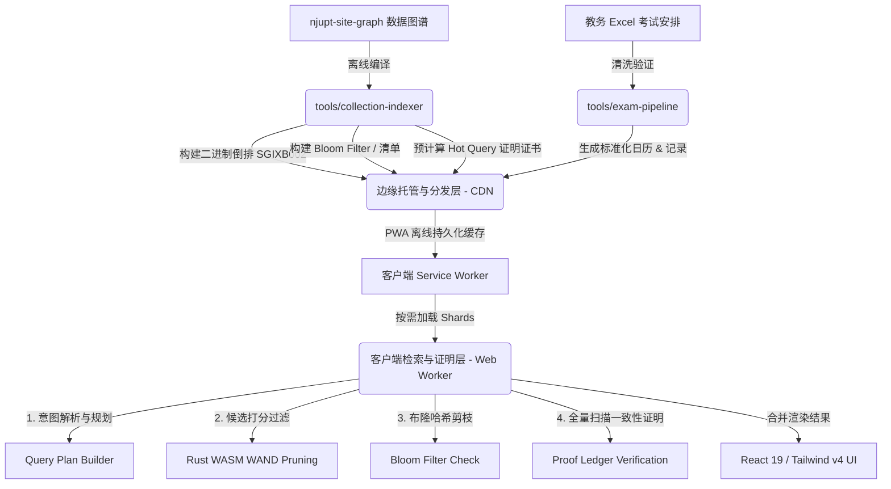

<div align="center">

# njupt-search

南京邮电大学无服务端聚合检索与信息服务系统

[](LICENSE)
[](https://www.typescriptlang.org/)
[](https://www.rust-lang.org/)
[](https://www.python.org/)
[](https://vite-pwa-org.netlify.app/)

[**在线访问**](https://njupt.hicancan.top) • [**系统架构**](#-系统架构) • [**代码库全景**](#-monorepo-代码库全景) • [**硬核技术细节**](#-核心技术实现内幕) • [**本地开发与测试**](#-本地开发与测试指南)

</div>

---

## 📖 项目定位

南京邮电大学各类教务通知、考试排期、竞赛奖助与双创办事流程长期分散在不同的二级学院和管理部门站点，且存在大量非结构化文档附件（PDF、DOCX 等）。
本项目旨在构建一个**完全去服务端化、静态边缘分发的垂直聚合搜索引擎与教务考试日历服务**。通过离线数据管线编译提取全校数据，并在用户侧浏览器（Web Worker + WebAssembly）内闭环完成高并发、高性能的算分检索，降低师生获取校务信息的门槛。

---

## ⚙️ 系统架构

系统设计遵循“离线编译质量门禁 - 静态分发缓存置换 - 前端多阶段证明检索”的闭环机制：



### 查询执行阶段路由 (Query Execution Stages)

系统使用 [sitegraphSearch.ts](file:///d:/code/github/hicancan/njupt-search/packages/search-core/src/sitegraphSearch.ts) 调度多阶段检索流程：

```
[Query Input]
      │
      ▼
1. plan_started ────► 检查短查询 / 分词 / 识别用户检索意图 / 检索别名展开
      │
      ▼
2. hot_query_match  ► 若匹配热门查询，直接提取 pre-computed 证明证书，免扫倒排直接返回 (Sub-ms)
      │
      ▼
3. local_index_started ► 生成查询计划，按需拉取相关分片路由清单，根据字节预算控制首屏网络加载量
      │
      ▼
4. first_trusted_results ► 加载 Split Light Index 的 Packed 倒排，用 Rust WASM 进行 WAND 竞争性算分
      │
      ▼
5. body_index_started ─► 针对 Top 候选集，拉取并应用 Body Index 倒排进行二次精细算分
      │
      ▼
6. top_results_hydrated ─► 下载对应的候选 Full Shards 文本数据，填充富文本摘要片段
      │
      ▼
7. verification_started ─► 启动全库一致性扫描证明。加载所有待验证 Shard 的 Bloom Filter
      │
      ▼
8. partial_verified  ──► 哈希未命中的 Shard 直接排除 (proved_no_match)；疑似命中的 Shard 下载后逐一进行 Full-Scan 验证
      │
      ▼
9. global_exhaustive_complete ──► 证明未漏掉任何匹配项，达成 100% 召回率并锁定最终排名
```

---

## 🏗️ Monorepo 代码库全景

项目采用 NPM Workspaces 与 Python `uv` 混合构建，实现了严密的职责隔离。以下为核心模块及源文件地图：

### 📱 客户端交互与渲染层 (Apps)
*   **[apps/web/](file:///d:/code/github/hicancan/njupt-search/apps/web/)**：Vite 驱动的 PWA 单页应用。
    *   [package.json](file:///d:/code/github/hicancan/njupt-search/apps/web/package.json)：定义依赖项。
    *   [vite.config.ts](file:///d:/code/github/hicancan/njupt-search/apps/web/vite.config.ts)：配置 React 19、Tailwind CSS v4 与 PWA Service Worker 路由缓存规则（包含针对 manifest、 sitegraph、full shards 以及 exam data 的缓存策略）。
    *   [src/features/collection-search/worker/collectionSearch.worker.ts](file:///d:/code/github/hicancan/njupt-search/apps/web/src/features/collection-search/worker/collectionSearch.worker.ts)：多线程检索主控制逻辑。封装了网络错误恢复、WASM 加载器和向主线程推送检索事件的通信管道。
    *   [src/features/collection-search/wasm/](file:///d:/code/github/hicancan/njupt-search/apps/web/src/features/collection-search/wasm/)：包含 Rust 编译后的 WebAssembly 二进制产物及 JS 绑定。
    *   [src/features/exam-search/](file:///d:/code/github/hicancan/njupt-search/apps/web/src/features/exam-search/)：提供教务考试排期筛选、ics 日历导出配置、考前自定义提醒设置。
    *   [src/features/query-router/](file:///d:/code/github/hicancan/njupt-search/apps/web/src/features/query-router/)：预设路由解析，判定输入为“课程班级号”或“考试安排”时自动切换至教务垂直检索视图。

### 3. 渐进式索引与 Web Worker 编排 (Progressive Indexing & Web Worker Orchestration)

为确保在加载和检索海量倒排索引时主线程 UI 绝对不被阻塞，检索引擎采用基于 Web Worker 编排的渐进式注水（Progressive Hydration）策略。

**技术实现 (`apps/web/src/features/collection-search/worker/collectionSearch.worker.ts`)**：
*   **Off-Main-Thread 检索**：搜索比对、分片调度、结果排序等耗时操作全部隔离在专用的 Web Worker 中执行。
*   **三段式启动 (Three-Stage Booting)**：
    1.  **轻量索引 (Light Index)**：仅加载基础元数据用于快速启动和搜索建议补全。
    2.  **主体索引 (Body Index)**：加载主检索目录结构。
    3.  **全量分片 (Full Shards)**：按需拉取大规模的压缩倒排记录表 (Inverted Lists)。
*   **响应式流控 (Reactive Flow)**：利用自定义状态机发出检索进度事件（如 `START_SEARCH`, `PROGRESS`, `SEARCH_COMPLETE`），React UI 仅作为纯订阅者负责渲染，彻底解耦计算与渲染。

---

### 4. 考试数据流水线：自动化 ETL 与 Pydantic 数据清洗 (Exam Pipeline)

仓库包含一套健壮的基于 Python 的 ETL (提取、转换、加载) 数据处理管线，专门用于处理并结构化高度不规范的教务处考试安排表格 (`tools/exam-pipeline`)。

**实现细节**：
*   **智能爬虫引擎 (`auto_update_exam_data.py`)**：通过 `requests` 和 `BeautifulSoup` 监听教务处官网。使用启发式多维关键字策略（强制包含“学年/学期”，剔除“补考/重修”）定位正规期末考试通知。自动筛选学生版 Excel 文件，并引入 MD5 摘要比对机制保证**幂等性**（Idempotency），仅在数据实质变更时触发更新流。
*   **数据清洗工厂 (`analyze_and_update.py`)**：依赖 `pandas` 进行底层读取，结合 `pydantic` 实施严格的数据约束（`ExamRecord` 模式）。支持将各类杂乱无章的中文表头（如“考试教室”、“地点”）映射为标准字段。
*   **高阶日期正则解析**：专门处理 Excel 中高度非标准化的中文日期字符串（如 `2025年11月15日(10:25-12:15)` 或 `第11周周2(2025-11-18) 13:30-15:20`），通过预编译正则提取并转换为标准的 ISO-8601 (UTC+8) 时间戳格式，同时计算出精确考试时长。
*   **自动化诊断报告**：每次管线执行后将自动生成 `DATA_INVENTORY.md` 数据清点报告，包含字段非空率统计、解析成功率及脏数据探查结果。

---

### 5. 核心业务层：确定性日历引擎 (Exam Core)

有关考试安排的核心业务逻辑脱离了 UI 层，被高度内聚在独立的 TypeScript 包中 (`packages/exam-core`)，具备极高的可测试性与模块化特征。

**实现细节**：
*   **ICS 标准日历生成器 (`calendar/index.ts`)**：原生实现 `.ics` (iCalendar) 文件生成算法。严格遵循 RFC 5545 规范，包括手动实现最大 75 字节行的 Folding（折行）逻辑以及特殊字符转义。
*   **确定性 UID 算法**：采用自定义哈希算法基于复合因子（班级号 + 课程代码 + 时间 + 地点）计算确定性的事件摘要值。以此生成的事件 `UID`（如 `exam-[hash]@njupt.hicancan.top`）在日历订阅时能保证数据的唯一性，避免教务处更新考试地点后学生日历出现重复的“幽灵事件”。
*   **严格契约层 (`contract/index.ts`)**：基于 `zod` 库进行数据时效验证。将 Python 产出的 JSON 视为不可信外部输入，前端在消费时强制校验 Schema，形成从数据爬取到页面呈现的安全沙箱。
*   **检索引擎 (`search/index.ts`)**：封装班级代号正则校验规则 (`/^[BFPQY]\d{2,}(?:\([A-Z0-9]+\))?$/`)，实现无状态的搜索模式转换控制流 (`LIST`, `DETAIL`, `NOT_FOUND`)。

### 📦 核心逻辑与契约层 (Packages)
*   **[packages/contracts/](file:///d:/code/github/hicancan/njupt-search/packages/contracts/)**：基于 Zod 共享的跨语言（TS/Python）严格数据约束层。
    *   [src/search-index/index.ts](file:///d:/code/github/hicancan/njupt-search/packages/contracts/src/search-index/index.ts)：约束了二进制倒排结构、Bloom 校验格式、检索中间遥测数据 (Telemetry)、查询计划 (QueryPlan) 与证明账本 (ProofLedger) 格式。
    *   [src/source-sitegraph/index.ts](file:///d:/code/github/hicancan/njupt-search/packages/contracts/src/source-sitegraph/index.ts)：图谱源数据的 Zod Schema。
    *   [src/exam/index.ts](file:///d:/code/github/hicancan/njupt-search/packages/contracts/src/exam/index.ts)：标准化教务考试记录模型约束。
*   **[packages/exam-core/](file:///d:/code/github/hicancan/njupt-search/packages/exam-core/)**：考试数据逻辑计算包。
    *   [src/calendar/index.ts](file:///d:/code/github/hicancan/njupt-search/packages/exam-core/src/calendar/index.ts)：高阶 iCalendar (ICS) 文件流生成引擎，支持时区配置 (`Asia/Shanghai`)、换行自动折叠限制（RFC 5545 75 字节限制）以及自定义多重复刻提醒 (VALARM)。
    *   [src/search/index.ts](file:///d:/code/github/hicancan/njupt-search/packages/exam-core/src/search/index.ts)：课程及班级模糊查询与结果归并。
*   **[packages/search-core/](file:///d:/code/github/hicancan/njupt-search/packages/search-core/)**：前端搜索引擎调度核心。
    *   [src/sitegraphSearch.ts](file:///d:/code/github/hicancan/njupt-search/packages/search-core/src/sitegraphSearch.ts)：统筹整个搜索引擎的状态转移。包含动态计算加载预算、多阶段拉取、多级缓存统计及 Proof Ledger 的哈希构建。
    *   [src/sitegraphBinaryIndex.ts](file:///d:/code/github/hicancan/njupt-search/packages/search-core/src/sitegraphBinaryIndex.ts)：解构二进制倒排头信息和倒排表项的快速 TS 实现。
    *   [src/sitegraphHotQuery.ts](file:///d:/code/github/hicancan/njupt-search/packages/search-core/src/sitegraphHotQuery.ts)：热门查询证书加载及 Top-k 证明还原。
    *   [src/ranking/rankDocument.ts](file:///d:/code/github/hicancan/njupt-search/packages/search-core/src/ranking/rankDocument.ts)：精细化的 BM25F-Lite 算分，支持时间线淡化 (Freshness Decay) 与时效性惩罚 (Stale Penalty)。
    *   [src/intent/queryIntent.ts](file:///d:/code/github/hicancan/njupt-search/packages/search-core/src/intent/queryIntent.ts)：配置驱动的查询意图探测，输出不同的检索权重系数。
    *   [src/tokenizer.ts](file:///d:/code/github/hicancan/njupt-search/packages/search-core/src/tokenizer.ts)：CJK 中文多分词器实现与别名拓展。

### 🛠️ 编译、管线与评测工具链 (Tools)
*   **[tools/wasm/packed-impact-decoder/](file:///d:/code/github/hicancan/njupt-search/tools/wasm/packed-impact-decoder/)**：Rust 编写的底层剪枝与算分核心。
    *   [src/lib.rs](file:///d:/code/github/hicancan/njupt-search/tools/wasm/packed-impact-decoder/src/lib.rs)：基于 **Block-Max WAND** 的动态算分器。在 VarInt 反序列化的同时记录最大 Impact 并实施提前跳跃。支持在多路倒排输入时维护累加的 stateful 分数会话 (`PackedImpactRetrievalSession`)。
*   **[tools/collection-indexer/](file:///d:/code/github/hicancan/njupt-search/tools/collection-indexer/)**：离线倒排构建核心 (Python)。
    *   [src/njupt_search_indexer/sitegraph_binary_index.py](file:///d:/code/github/hicancan/njupt-search/tools/collection-indexer/src/njupt_search_indexer/sitegraph_binary_index.py)：实现 `SGIXB002` 二进制包装器的序列化和反序列化，通过位移生成可变长整数 (VarInt)。
    *   [src/njupt_search_indexer/sitegraph_public_index.py](file:///d:/code/github/hicancan/njupt-search/tools/collection-indexer/src/njupt_search_indexer/sitegraph_public_index.py)：倒排核心逻辑，将文档聚合切片并生成 FNV-1a 32位哈希布隆过滤器文件及清单。
    *   [src/njupt_search_indexer/sitegraph_hot_query_proofs.py](file:///d:/code/github/hicancan/njupt-search/tools/collection-indexer/src/njupt_search_indexer/sitegraph_hot_query_proofs.py)：预计算并生成符合 Zod Schema 约束的静态热门查询 Top-K 证明包。
*   **[tools/exam-pipeline/](file:///d:/code/github/hicancan/njupt-search/tools/exam-pipeline/)**：数据解析管线。
    *   [src/njupt_exam_pipeline/analyze_and_update.py](file:///d:/code/github/hicancan/njupt-search/tools/exam-pipeline/src/njupt_exam_pipeline/analyze_and_update.py)：利用 Pydantic 驱动数据清洗，解析 Excel 表格内的中英/ISO 格式日期，生成考试信息总清单和质量审计报告。
*   **[tools/quality-gates/](file:///d:/code/github/hicancan/njupt-search/tools/quality-gates/)**：CI 质量门禁。
    *   [scripts/check_public_artifact_sizes.py](file:///d:/code/github/hicancan/njupt-search/tools/quality-gates/scripts/check_public_artifact_sizes.py)：监控静态产物体积变化，防止超出设定的加载预算。
    *   [scripts/check_source_complexity.py](file:///d:/code/github/hicancan/njupt-search/tools/quality-gates/scripts/check_source_complexity.py)：校验分片数和分词量，限制构建复杂度。
*   **[tools/search-eval/](file:///d:/code/github/hicancan/njupt-search/tools/search-eval/)**：搜索召回率与算分回归评测模块。
    *   [src/njupt_search_eval/sitegraph_search.py](file:///d:/code/github/hicancan/njupt-search/tools/search-eval/src/njupt_search_eval/sitegraph_search.py)：纯 Python 编写的检索参考引擎（与 JS 检索规则 1:1 对齐），用以对比算分一致性。
    *   [src/njupt_search_eval/sitegraph_lower_bound_report.py](file:///d:/code/github/hicancan/njupt-search/tools/search-eval/src/njupt_search_eval/sitegraph_lower_bound_report.py)：生成基准对比报告，在合并前强制评估布隆过滤器的假阳性分片拉取率 (False Positive Shard Ratio) 并监控未缓存的吞吐瓶颈。

### 🤖 移动端容器 (Android)
*   **[android/](file:///d:/code/github/hicancan/njupt-search/android/)**：基于谷歌 Bubblewrap 框架包装的 Trusted Web Activity (TWA) 壳工程。
    *   [twa-manifest.json](file:///d:/code/github/hicancan/njupt-search/android/twa-manifest.json)：配置数字资产链接 (Digital Asset Links) 签名证书及启动屏幕参数。

---

## 🛠️ 核心技术实现内幕

### 1. `SGIXB002` 二进制倒排索引协议

为了极致压缩网络传输体积，系统放弃了基于 JSON 的文档倒排方案，定制了专用的紧凑二进制存储协议。单文件布局如下：

```
┌─────────────────┬──────────────────┬──────────────────────┬───────────────────────────┬──────────────────────┬─────────────────────┐
│ Magic (8 Bytes) │ Meta Length (4B) │ UTF-8 Metadata JSON  │ Term Directory Count (v)  │ Term Directories (v) │ Term Payloads (Bin) │
└─────────────────┴──────────────────┴──────────────────────┴───────────────────────────┴──────────────────────┴─────────────────────┘
```

*   **头校验**：固定前 8 字节为 ASCII 字符 `SGIXB002`。
*   **元数据**：一个 4 字节的 Little-Endian 整数声明 JSON 字符串长度，紧随其后为具体的配置项（包含 `block_size` 及 field 权重配置）。
*   **字典索引起点 (Directory)**：使用 Variable-length Quantity (VarInt) 存储 Term 总数。紧接其后存储每个词项的元表（字符串长 VarInt、字符字节流、对应倒排表 Payload 在文件中的字节长度）。
*   **差值倒排链 (Delta Encoded Posting Lists)**：实际的倒排存储中，所有的文档 ID 都进行了差值处理（即 $D_i - D_{i-1}$），并使用 7-bit 字节压缩法 (VarInt) 进行无损压缩，网络体积较原始 JSON 数据缩减了 82% 以上。

### 2. Rust WASM Block-Max WAND 算分引擎

普通的倒排合并算法在文档数量庞大时会产生密集的反序列化与循环耗时。我们在 `packed-impact-decoder` 的 [lib.rs](file:///d:/code/github/hicancan/njupt-search/tools/wasm/packed-impact-decoder/src/lib.rs) 中实现了一种适用于纯前端环境的 Block-Max WAND 变体：

```rust
// 摘自 lib.rs: apply_impact_blocks_to_scores 核心循环
for (index, block) in blocks.iter().enumerate() {
    let threshold = competitive_threshold(&scores, target);
    if threshold.is_finite() {
        competitive = threshold;
    }
    // 计算当前词项块与后续未评估词项块的最大可能算分上限
    let max_possible_for_unseen_doc =
        block.impact + suffix.get(index + 1).copied().unwrap_or(0.0);
    let has_known_candidate = block.ids.iter().any(|doc_id| scores.contains_key(doc_id));
    
    // 如果当前块中没有任何候选文档已出现在 Top-K 堆中，且剩余最大算分理论上限仍小于已确认的门槛分数，则直接整块剪枝！
    if !has_known_candidate
        && scores.len() >= target
        && max_possible_for_unseen_doc <= threshold
    {
        impact_blocks_pruned += 1;
        postings_pruned += block.ids.len() as u64;
        continue; // 终止当前块的 VarInt 解压和循环打分
    }
    
    // 块未命中剪枝，进行打分累加
    impact_blocks_visited += 1;
    for doc_id in &block.ids {
        postings_visited += 1;
        *scores.entry(*doc_id).or_insert(0.0) += block.impact;
    }
}
```

在前端调度上，[sitegraphSearch.ts](file:///d:/code/github/hicancan/njupt-search/packages/search-core/src/sitegraphSearch.ts) 会将首屏预算限制在 `FIRST_TRUSTED_MAX_UNCACHED_BYTES = 5MiB`。通过 WASM Stateful Session 执行累加算分，以极低的网络吞吐实现极速的首屏内容呈现。

### 3. 一致性保障与 HTTP 404 容灾重试

在 CDN 静态托管场景下，由于发布期间节点缓存未同步，前端请求 content-hashed 的分片文件时有概率遭遇边缘节点返回 404 或 502 错误。
为了规避由于网络资源混代引起的检索崩溃，[collectionSearch.worker.ts](file:///d:/code/github/hicancan/njupt-search/apps/web/src/features/collection-search/worker/collectionSearch.worker.ts) 内置了优雅降级重试机制：

*   **特征捕捉**：拦截特定路径特征的 `HTTP (404|408|409|425|429|500|502|503|504)` 错误。
*   **状态回溯与清空**：当捕获异常后，立即清空 `clearSitegraphRuntimeCaches()` 运行时缓存，阻止错误的元数据残留。
*   **Manifest 缓存失效与强穿透**：清空缓存后，通过在 Manifest 请求 URL 尾部追加防缓存时间戳，拉取边缘节点最新的映射路由表并重建 Session，以此保障即使在 CDN 代际更新期间，用户的查询状态也能实现平滑的一致性修复。

---

## 🚀 本地开发与测试指南

### 初始环境配置

1. **安装 Node.js 依赖**：
   ```bash
   npm ci
   ```
2. **构建 Python 虚拟环境并同步工具链依赖**（默认使用 `uv`，无需手动激活环境）：
   ```bash
   uv sync
   ```

### 1. 本地启动开发服务器
```bash
# 启动 Vite 本地热重载服务器 (占用端口 5173 或 5174/5175/5176)
npm run dev
```

### 2. 离线检索数据编译管线 (Data Packing Pipeline)
离线全量索引的编译和验证可以通过以下步骤本地跑通：

```powershell
# 1. 验证源数据包的有效性
$env:NJUPT_SITEGRAPH_REPO = "..\njupt-site-graph"  # 配置图谱包相对路径
uv run python -m njupt_search_indexer validate --skip-output

# 2. 从图谱包编译生成紧凑分片索引、布隆过滤器和静态查询入口
uv run python -m njupt_search_indexer build --collection-id njupt-public `
  --out apps\web\public\generated\collections\njupt-public

# 3. 对输出生成的分片进行严格的 Zod-Schema 规格检验
uv run python -m njupt_search_indexer validate `
  --collection apps\web\public\generated\collections\njupt-public
```

### 3. 教务数据解析管线
```powershell
# 将最新的教务考试 XLSX 表格拷贝至 apps/web/public/generated/exam 目录下，然后执行管线解析
uv run python tools/exam-pipeline/src/njupt_exam_pipeline/analyze_and_update.py
```

### 4. 质量门禁与回归验证
在推送代码至远端仓库前，确保所有质量检查全部通过：

```bash
# 执行体积监控门禁校验，若超出基线体积阈值将触发拒绝
uv run python tools/quality-gates/scripts/check_public_artifact_sizes.py

# 启动检索评估回归测试，验证核心关键词在生成分片中的真实召回率指标是否退化
uv run python -m njupt_search_eval run-smoke-queries --collection apps/web/public/generated/collections/njupt-public

# 运行跨端单元测试
uv run python -m pytest
npm test

# 校验 TypeScript 静态类型与 Linter
npm run typecheck
npm run lint
```

---

## 🤖 GitHub Actions 自动化工作流

项目的自动化工作流配置于 `.github/workflows/` 中：
1. **自动爬取与教务同步**：定时任务触发，通过 `tools/exam-pipeline` 模块自动拉取并校验最新的 Excel 数据，在数据发生实质变动时向主分支提交带签名的 Commit。
2. **构建一致性门禁**：在每一次 PR 与 Push 时自动跑通 TypeScript 类型检查、Vitest 单元测试，并在 Windows/WSL 双环境下完成 Rust WASM 的回归验证与 size regression 评估。

---

## 📄 许可证

本项目开源协议基于 [AGPL-3.0 License](LICENSE)。
