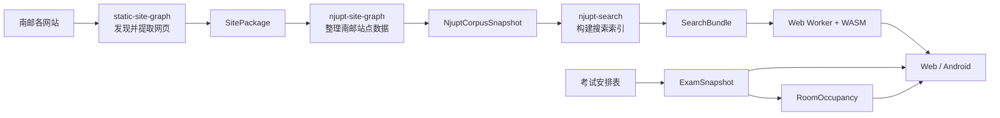

<div align="center">


# njupt-search

### 南京邮电大学校园信息搜索

聚合南邮官网正文与附件，并提供考试安排、日历导出和教室占用查询。<br />
无需搜索服务器，全文检索直接在浏览器中完成。

[](https://njupt.hicancan.top)
[](https://github.com/hicancan/njupt-search/actions/workflows/ci.yml)
[](https://github.com/hicancan/njupt-search/releases/latest)
[](LICENSE)

[**在线访问**](https://njupt.hicancan.top) ·
[**Android 下载**](https://github.com/hicancan/njupt-search/releases/latest/download/njupt-search-latest.apk) ·
[**功能一览**](#-功能一览) ·
[**工作原理**](#️-搜索如何工作) ·
[**本地开发**](#-本地开发)

</div>

---

## 📖 为什么做这个项目

南邮的信息不是没有，而是太分散。

通知、规章、讲座、竞赛和办事流程散落在不同学院与部门的网站里，重要内容
还经常藏在 PDF、Word 或 Excel 附件中。想找一条信息，往往得先猜发布部门，
再到几个站点之间来回翻找。

`njupt-search` 把上游收集的校园网页和附件编译成统一索引，让这些内容可以在
一个搜索框里查到。考试安排、ICS 日历和教室占用也放在同一个网站中，省去在
多个入口之间切换的麻烦。

当前完整开发语料包含 **15 个信息来源、20,663 条网页和文档记录，以及 8,945
个附件**。数据由自动化任务持续更新，网站代码不需要跟着每次数据变化而修改。

---

## ✨ 功能一览

| 🔎 校园信息搜索 | 📅 考试与日历 | 🏫 教室占用 | 🦀 浏览器本地检索 |
| :--- | :--- | :--- | :--- |
| 搜索官网正文与附件，支持按来源、内容类型和日期筛选。 | 输入班级即可查看考试时间与地点，并导出 ICS 日历。 | 按校区、教学楼、楼层和日期查看考试占用情况。 | Rust 搜索引擎通过 WebAssembly 在 Web Worker 中运行，不依赖在线搜索接口。 |

Web 页面可以直接使用；Android 版本通过 TWA 提供与网站一致的功能。

---

## 🛠️ 搜索如何工作

### 1. 静态索引，而不是在线搜索服务

校园语料会预先编译为 `SearchBundle`：

```text
manifest.json
documents.bin
lexicon.bin
postings-*.bin
content-*.bin
```

这些文件可以直接放在静态存储和 CDN 上。浏览器不需要连接 Elasticsearch、
数据库或项目自建的搜索服务器，因此部署简单，也不会把用户的查询发送给搜索
后端。

### 2. Native 与 Web 共用一套 Rust 搜索引擎

文本规范化、分词、索引编译、候选召回、排序和摘要都由 `search/core` 实现。
构建索引和本地查询时直接运行这套 Rust 代码；浏览器则通过 WebAssembly 调用
同一个 core。两端不会因为分别维护算法而出现结果漂移。

### 3. 按查询加载需要的数据

页面不会一上来就下载搜索索引。用户聚焦搜索框或开始输入后，WASM 初始化与
manifest 读取并行进行，再加载文档目录和词典。查询时只取相关倒排索引块，
完整处理查询词并完成一次准确排序后，页面马上显示标题、来源、日期和链接；
随后只加载当前 10 条结果对应的正文，补上摘要。摘要出现前后，结果顺序不会
变化，也不会为了首屏先生成 80 条暂时看不到的内容。

这里的“先显示”不是近似搜索。Rust core 先生成一份稳定的 `QueryPlan`，结果
骨架与正文摘要都从同一份计划读取；正文到达后只补充展示内容，不会再次召回或
排名。正文采用约 128 KiB 的目标块大小，二进制先使用紧凑布局，再用 zstd
压缩，以兼顾请求数量和移动网络流量。

### 4. 搜索运行在 Web Worker 中

网络请求、解压和查询在独立 Worker 中完成，不阻塞 React 主线程。连续搜索以
最新一次为准，新结果骨架到达前保留原结果，避免页面闪空。缓存由每个搜索实例
自行管理，设有明确的容量预算和 LRU 淘汰；取消查询、重新初始化或关闭实例时，
相应的请求和运行状态也会被释放。

排序先区分标题完整短语、全部核心词和部分核心词，再在相同相关层级内考虑来源
与发布时间。`大创`、`四六级`、`计算机等级` 等常用简称在同一个 Rust 查询分析
流程中展开，不使用预制结果或人工置顶。首页的考试、教室和七个全文检索入口是
明确的产品意图；全文入口仍然走同一套索引、召回和排名。

### 最近一次完整构建

| 项目 | 结果 |
| --- | ---: |
| 收录文档 | 20,663 |
| SearchBundle 文件数 | 344 |
| SearchBundle 大小 | 39.58 MiB |
| 完整索引核心编译时间 | 7.70 秒 |
| 查询测试 | 156 条 |
| Native 查询 P50 / P95 | 约 5.4 ms / 16.7 ms |
| 七个首页全文入口 | Top-1 全部满足意图，Top-10 无重复 URL |

以上数据来自 2026 年 8 月 19 日的固定完整语料重建，后续会随语料更新而变化。

---

## 🗺️ 数据与产品链路



这三个仓库各自负责一段清楚的工作：

- [`static-site-graph`](https://github.com/hicancan/static-site-graph) 提供通用的
  网站发现、抓取和内容提取能力；
- [`njupt-site-graph`](https://github.com/hicancan/njupt-site-graph) 保存南邮站点
  配置，并输出统一的 `NjuptCorpusSnapshot`；
- 本仓库读取语料快照、构建搜索索引，并提供搜索、考试和教室产品。

爬取代码不在本仓库中。输入语料缺失、损坏或引用不完整时，索引构建会直接
报错，而不是自动换用旧数据。完整的数据格式与依赖关系见
[架构文档](docs/architecture.md)。

---

## 🏗️ 代码结构

```text
njupt-search/
├── apps/
│   ├── web/          # React Web 应用
│   └── android/      # Android TWA 外壳
├── search/
│   ├── core/         # Rust 搜索引擎与 SearchBundle
│   ├── native/       # 索引构建、命令行查询与性能入口
│   ├── wasm/         # search/core 的 WebAssembly 接口
│   └── browser/      # Worker、缓存和 SearchClient
├── academics/
│   ├── exam/         # 考试源、ExamSnapshot、查询与 ICS
│   └── room/         # 教室目录、RoomOccupancy 与查询
├── benchmarks/       # 搜索质量、性能与浏览器测试
├── ops/              # 本地构建、测试和 Web 组装脚本
└── docs/             # 当前架构和数据格式说明
```

搜索、教务和界面代码按各自处理的对象组织，而不是按编程语言集中到
`packages` 或 `tools`。Native 与 WASM 共同依赖 `search/core`，浏览器端不再
维护另一套分词和排序逻辑。

---

## 🚀 本地开发

### 环境要求

- Node.js 24
- Rust stable、`wasm32-unknown-unknown` 和 `wasm-pack`
- Python 3.10+ 与 `uv`

安装依赖并运行快速测试：

```powershell
npm ci
uv sync --extra test
.\ops\test.ps1 -Mode quick
```

### 构建搜索索引

源码仓库不保存语料和生成后的索引。使用外部的 `NjuptCorpusSnapshot` 构建：

```powershell
.\ops\build-search-bundle.ps1 `
  -CorpusPath D:\Data\njupt-refactor\corpus-current `
  -BundlePath D:\Data\njupt-refactor\njupt-search-current\search-bundle
```

### 构建考试与教室数据

```powershell
uv run python -m academics.exam discover `
  --output D:\Data\njupt-refactor\njupt-search-current\exam-source.json

.\ops\build-academics.ps1 `
  -SourcePath D:\Data\njupt-refactor\njupt-search-current\exam-source.json `
  -MaterializedPath D:\Data\njupt-refactor\njupt-search-current\exam-materialized `
  -CachePath D:\Cache\njupt-search\exam-source `
  -ExamOutputPath D:\Data\njupt-refactor\njupt-search-current\exam-snapshot `
  -RoomOutputPath D:\Data\njupt-refactor\njupt-search-current\room-occupancy `
  -RoomCatalogPath .\academics\room\catalog\njupt-room-catalog.json
```

### 组装 Web 页面

```powershell
.\ops\assemble-web.ps1 `
  -SearchBundlePath D:\Data\njupt-refactor\njupt-search-current\search-bundle `
  -ExamSnapshotPath D:\Data\njupt-refactor\njupt-search-current\exam-snapshot `
  -RoomOccupancyPath D:\Data\njupt-refactor\njupt-search-current\room-occupancy `
  -StagePath D:\Temp\njupt-search\stage `
  -DistPath D:\Temp\njupt-search\dist
```

开发服务器需要使用组装目录中的静态文件：

```powershell
$env:NJUPT_SEARCH_WEB_PUBLIC_DIR = 'D:\Temp\njupt-search\stage\public'
$env:VITE_NJUPT_SEARCH_ARTIFACT_URL = '/generated/search'
$env:VITE_NJUPT_EXAM_ARTIFACT_URL = '/generated/exam'
$env:VITE_NJUPT_ROOM_ARTIFACT_URL = '/generated/rooms'
npm run dev -- --host 127.0.0.1
```

运行完整的 156 条查询测试：

```powershell
node benchmarks\search\quality.mjs `
  --bundle D:\Data\njupt-refactor\njupt-search-current\search-bundle
```

---

## 🔄 自动更新

校园语料和教务数据分别构建，只在生成网站时组合：

```text
NjuptCorpusSnapshot → SearchBundle
ExamSourceDescriptor → ExamSnapshot → RoomOccupancy
```

构建结果发布到 GHCR。任意一类数据更新后，GitHub Actions 会读取三份明确的
数据产物，重新组装网站并部署到 EdgeOne。Git Tags 和 GitHub Releases 只用于
发布软件版本及 Android 安装包，不用于保存滚动更新的校园语料。

---

## 📄 说明与许可

- 本项目不是南京邮电大学官方服务，请以学校和各部门正式发布的信息为准。
- 校园网站及教务数据的相关权利归原发布方所有。
- 项目主要用于学习、研究和非商业的校园信息服务。
- 源代码采用 [AGPL-3.0](LICENSE) 许可。
