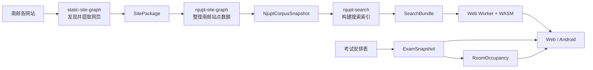

<div align="center">


# njupt-search

南京邮电大学校园信息搜索

支持官网全文检索、考试安排和教室占用查询。搜索索引以静态文件发布，
查询直接在浏览器中完成。

[](https://njupt.hicancan.top)
[](https://github.com/hicancan/njupt-search/actions/workflows/ci.yml)
[](https://github.com/hicancan/njupt-search/releases/latest)
[](LICENSE)

[在线使用](https://njupt.hicancan.top) ·
[Android 下载](https://github.com/hicancan/njupt-search/releases/latest/download/njupt-search-latest.apk) ·
[架构说明](docs/architecture.md) ·
[本地开发](#本地开发)

</div>

---

## 项目简介

做这个项目的原因很简单：南邮的通知、规章、办事流程和讲座信息分散在不同
部门与学院的网站上，很多重要内容还放在 PDF、Word 或 Excel 附件里。查一条
信息时，往往要先猜它由哪个部门发布，再到对应网站里翻找。

`njupt-search` 把已经收集的校园网页和附件整理成统一索引，让这些内容可以在
一个页面里搜索。除了全文检索，网站还可以按班级查询考试安排、导出 ICS 日历，
以及按校区、教学楼和日期查看教室占用情况。

目前线上索引包含 15 个信息来源、21,588 条网页和文档记录，以及 8,947 个附件。数据会由
GitHub Actions 定期更新，无需为每次数据更新修改搜索代码。

## 主要功能

- **校园信息搜索**：检索网页正文和附件，支持按来源、内容类型和日期筛选。
- **考试安排**：输入班级名称即可查看考试时间、地点和课程信息。
- **日历导出**：将考试安排导出为 ICS 文件，导入常见日历应用。
- **教室占用**：按校区、教学楼、楼层和日期查看考试占用情况。
- **Web 与 Android**：网页可以直接使用，也提供 Android 安装包。

## 技术实现

搜索请求不会发送到在线搜索服务。浏览器先加载文档目录和词典，输入查询后再
读取相关的倒排索引块；确定前几条结果后，才继续加载对应的正文块。这样既能
保留完整索引，也不需要在打开页面时下载全部内容。

索引构建和查询逻辑都写在 `search/core` 中。命令行工具直接调用这套 Rust
代码，浏览器则通过 WebAssembly 调用它，因此本地构建、性能测试和网页搜索
使用的是同一套分词、召回和排序规则。网络读取、缓存、取消查询和 Web Worker
由 TypeScript 负责，页面使用 React 构建。

最近一次线上构建的数据如下：

| 项目 | 结果 |
| --- | ---: |
| 收录文档 | 21,588 |
| SearchBundle 文件数 | 133 |
| SearchBundle 大小 | 39.68 MiB |
| 完整索引构建时间 | 9.93 秒 |
| 查询测试 | 156 条 |
| Native 查询 P50 / P95 | 15.95 ms / 61.13 ms |

这些数字来自 2026 年 7 月 31 日的线上构建，后续会随语料更新而变化。

## 数据从哪里来



三个仓库的分工如下：

- [`static-site-graph`](https://github.com/hicancan/static-site-graph) 提供通用的
  网站发现、抓取和内容提取能力。
- [`njupt-site-graph`](https://github.com/hicancan/njupt-site-graph) 保存南邮站点
  配置，并把各站点数据整理成 `NjuptCorpusSnapshot`。
- 本仓库读取这份语料，构建 `SearchBundle`，并提供搜索、考试和教室页面。

爬取代码不在本仓库中。`njupt-search` 只读取已经生成的语料快照，并在输入缺失、
文件损坏或引用不完整时停止构建。更详细的数据格式和依赖关系见
[架构说明](docs/architecture.md)。

## 目录结构

```text
apps/         Web 页面和 Android 外壳
search/       Rust 搜索引擎、命令行工具、WASM 和浏览器运行时
academics/    考试数据处理、日历导出和教室占用
benchmarks/   搜索质量与性能测试
ops/          本地构建、测试和 Web 组装脚本
docs/         架构和数据格式说明
```

## 本地开发

需要 Node.js 24、Rust stable、`wasm32-unknown-unknown`、`wasm-pack`、
Python 3.12 和 `uv`。

安装依赖并运行快速测试：

```powershell
npm ci
uv sync --extra test
.\ops\test.ps1 -Mode quick
```

### 构建完整数据

源码仓库不包含语料和生成后的索引。下面的命令使用外部数据目录构建
SearchBundle：

```powershell
.\ops\build-search-bundle.ps1 `
  -CorpusPath D:\Data\njupt-refactor\corpus-current `
  -BundlePath D:\Data\njupt-refactor\njupt-search-current\search-bundle
```

考试和教室数据也写入外部目录：

```powershell
uv run python -m academics.exam discover `
  --output D:\Data\njupt-refactor\njupt-search-current\exam-source.json

.\ops\build-academics.ps1 `
  -SourcePath D:\Data\njupt-refactor\njupt-search-current\exam-source.json `
  -MaterializedPath D:\Data\njupt-refactor\njupt-search-current\exam-materialized `
  -CachePath D:\Cache\njupt-search\exam-source `
  -ExamOutputPath D:\Data\njupt-refactor\njupt-search-current\exam-snapshot `
  -RoomOutputPath D:\Data\njupt-refactor\njupt-search-current\room-occupancy `
  -RoomCatalogPath .\academics\room\catalog\njupt-room-catalog.json
```

### 组装并启动 Web 页面

先把三类数据放进临时的 Web 组装目录（staging）：

```powershell
.\ops\assemble-web.ps1 `
  -SearchBundlePath D:\Data\njupt-refactor\njupt-search-current\search-bundle `
  -ExamSnapshotPath D:\Data\njupt-refactor\njupt-search-current\exam-snapshot `
  -RoomOccupancyPath D:\Data\njupt-refactor\njupt-search-current\room-occupancy `
  -StagePath D:\Temp\codex\njupt-search-web\stage `
  -DistPath D:\Temp\codex\njupt-search-web\dist
```

开发服务器需要显式使用 staging 中的静态文件：

```powershell
$env:NJUPT_SEARCH_WEB_PUBLIC_DIR = 'D:\Temp\codex\njupt-search-web\stage\public'
$env:VITE_NJUPT_SEARCH_ARTIFACT_URL = '/generated/search'
$env:VITE_NJUPT_EXAM_ARTIFACT_URL = '/generated/exam'
$env:VITE_NJUPT_ROOM_ARTIFACT_URL = '/generated/rooms'
npm run dev -- --host 127.0.0.1
```

完整查询测试：

```powershell
node benchmarks\search\quality.mjs `
  --bundle D:\Data\njupt-refactor\njupt-search-current\search-bundle
```

## 自动更新

校园语料和教务数据分别构建，只有在生成网页时才放到一起：

```text
NjuptCorpusSnapshot → SearchBundle
ExamSourceDescriptor → ExamSnapshot → RoomOccupancy
```

这些数据存放在 GHCR，而不是 Git Tags 或 GitHub Releases 中。GitHub Releases
只发布软件版本和 Android 安装包。任意一类数据更新后，Actions 会重新组装
完整网站并部署到 EdgeOne。

## 说明

- 本项目不是南京邮电大学官方服务，请以学校和各部门正式发布的信息为准。
- 校园网站及教务数据的相关权利归原发布方所有。
- 项目主要用于学习、研究和非商业的校园信息服务。

## 开源协议

[AGPL-3.0](LICENSE)
